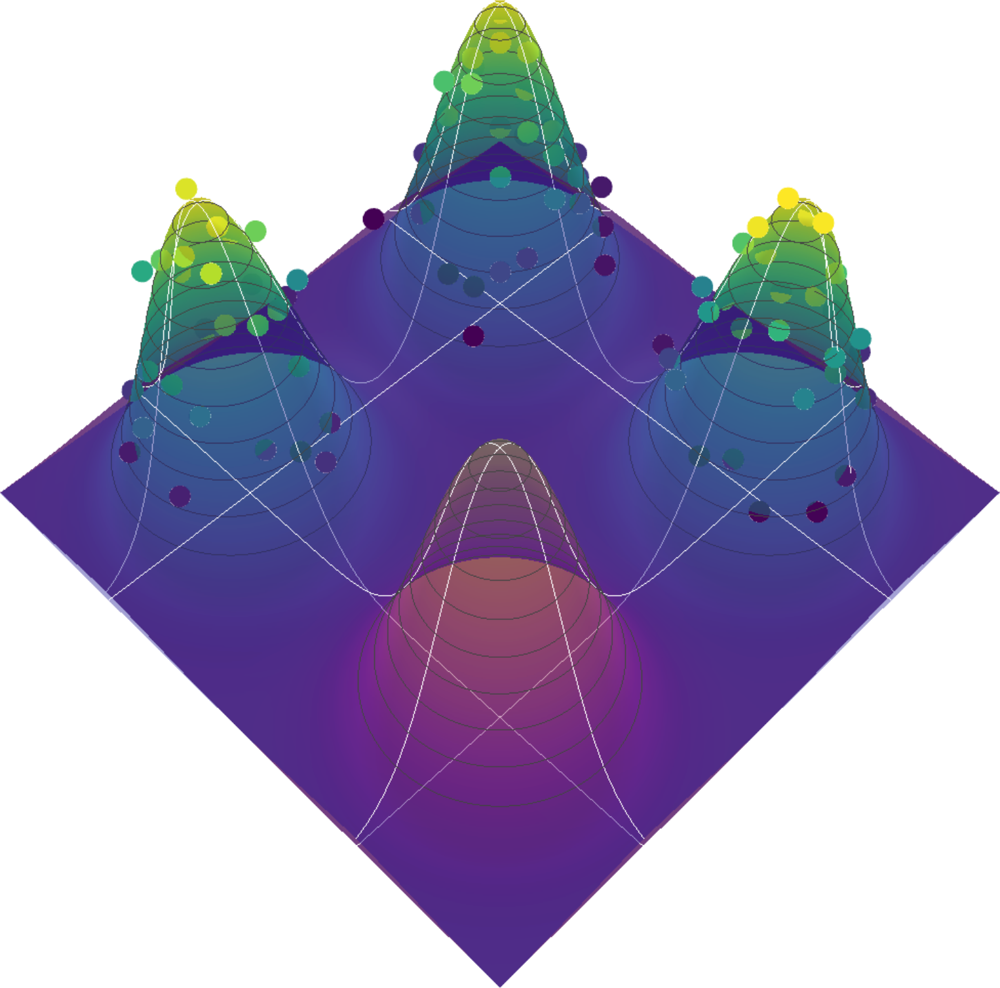
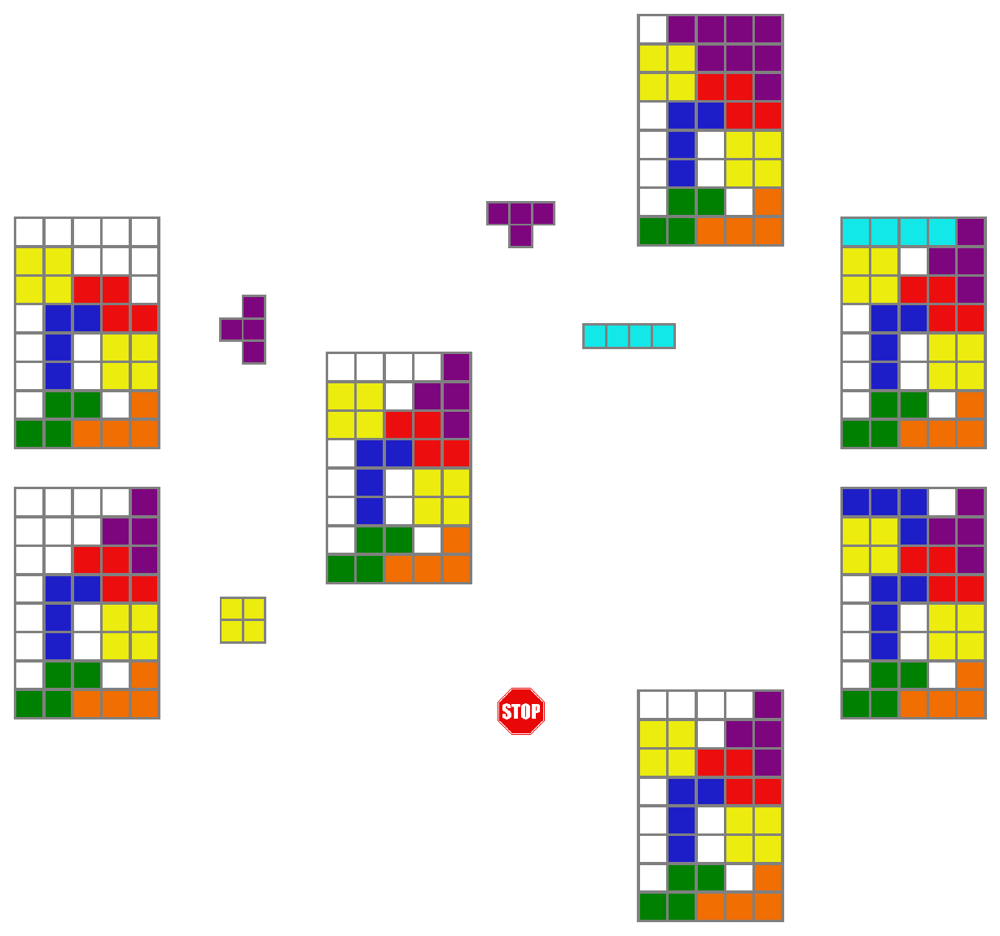

# gflownet

gflownet is a library built upon [PyTorch](https://pytorch.org/) to easily train and extend [GFlowNets](https://arxiv.org/abs/2106.04399), also known as GFN or generative flow networks. GFlowNets are a machine learning framework for probabilistic and generative modelling, with a wide range of applications, especially in [scientific discovery](https://pubs.rsc.org/en/content/articlelanding/2023/dd/d3dd00002h) problems.

In a nutshell, GFlowNets can be regarded as a generative model designed to sample objects $x \in \mathcal{X}$ proportionally to a reward function $R(x)$. This results in the potential of sampling diverse objects with high rewards. For example, given the reward landscape depicted below, defined over a two-dimensional space, a well-trained GFlowNet will be able to sample from the four high-reward corners with high probability.

<p align="center">
  
</p>

GFlowNets rely on the principle of **compositionality** to generate samples. A meaningful decomposition of samples $x$ into multiple intermediate states $s_0\rightarrow s_1 \rightarrow \dots \rightarrow x$ can yield generalisable patterns. These patterns can then be learned by neural networks trained to model the value of transitions $F_{\theta}(s_t \rightarrow s_{t+1})$.

Consider the problem of generating [Tetris](https://en.wikipedia.org/wiki/Tetris)-like boards. A natural decomposition of the sample generation process would be to add one piece at a time, starting from an empty board. For any state representing a board with pieces, we could identify its valid parents and children, as illustrated in the figure below.

<p align="center">
  
</p>

We could define a reward function $R(x)$ as the number of cells occupied by pieces, for instance. The goal of training a GFlowNet on this task would be to discover (sample) diverse solutions (boards with pieces) with high rewards. This represents an intuitive yet complex problem where GFlowNets can be used, which is [implemented in this library](https://github.com/alexhernandezgarcia/gflownet/blob/ahg/313-update-readme-components/gflownet/envs/tetris.py). Many problems in scientific discoveries, such as the inverse design of proteins, molecules, or crystals share similarties with this intuitive task.

## Main Components of the GFlowNet Library

The GFlowNet library comprises four core components: environment, proxy, policy models (forward and backward), and GFlowNet agent.

### Environment

The environment defines the state space $\mathcal{S}$ and action space $\mathbb{A}$ of a particular problem, for example the Tetris task. To illustrate the environment, let's consider an even simpler environment currently implemented in the library: the [Scrabble](https://en.wikipedia.org/wiki/Scrabble) environment, inspired by the popular board game.

The Scrabble environment simulates a simple letter arrangement game where words are constructed by adding one letter at a time, up to a maximum sequence length (typically 7). Therefore, the action space is the set of all English letters plus a special end-of-sequence (EOS) action; and the state space is the set of all possible words with up to 7 letters. We can represent each `state` as a list of indices corresponding to the letters, padded with zeroes to the maximum length. For example, the state for the word "CAT" would be represented as `[3, 1, 20, 0, 0, 0, 0]`. Actions in the Scrabble environment are single-element tuples containing the index of the letter, plus the end-of-sequence (EOS) action `(-1,)`.

Using the gflownet library for a new task will typically require implementing your own environment. The library is particularly designed to make such extensions as easy as possible. In the documentation, we show how to do it step by step. You can also watch [this live-coding tutorial](https://www.youtube.com/watch?v=tMVJnzFqa6w&t=5h22m35s) on how to code the Scrabble environment.

### Proxy

We use the term "[proxy](gflownet/proxy/base.py)" to refer to the function or model that provides the rewards for the states of an environment. In other words, In the context of GFlowNets, the proxy can be thought of as a function $E(x)$ from which the reward is derived: $R(x) = g(E(x))$, where $g$ is a function that transforms the proxy values into non-zero rewards, that is "the higher the reward the better". For example, we can implement a proxy that simulates the scores of a word in the Scrabble game. That is, the [`ScrabbleScorer`](gflownet/proxy/scrabble.py) proxy computes the sum of the score of each letter of a word. For the word "CAT" that is $E(x) = 3 + 1 + 1 = 5$. While in many environments the proxy functions is a simple scorer, more complex settings like molecule or [crystal generation](gflownet/proxy/crystals/dave.py) may be use proxies that represent the energy or a property predicted by a pre-trained machine learning model.

Adapting the gflownet library for a new task will also likely require implementing your own proxy, which is usually fairly simple, as illustrated in the documentation.

### Policy models

The policy models are neural networks that model the forward and backward transitions between states, $F_{F_{\theta}}(s_t \rightarrow s_{t+1})$ (forward) and $F_{B_{\theta}}(s_{t+1} \rightarrow s_t)$ (backward). These models take a state as input and output a distribution over the actions in the action space. For continuous environments, the outputs are the parameters of a probability distribution to sample continuous-valued actions. For many tasks, simple multi-layer perceptrons with a few layers do the job, but technically any architecture could be used as policy model. 

### GFlowNet Agent

The GFlowNet Agent is the central component that ties all others together. It orchestrates the interaction between the environment, policies, and proxy, as well as other auxiliary components such as the Evaluator and the Logger. The GFlowNet can construct training batches by sampling trajectories, optimise the policy models via gradient descent, compute evaluation metrics, log data to [Weights & Biases](https://wandb.ai/), etc. The agent can be configured to optimise any of the following loss functions implemented in the library: [flow matching (FM)](https://arxiv.org/abs/2106.04399), [trajectory balance (TB)](https://arxiv.org/abs/2201.13259), [detailed balance (TB)](https://arxiv.org/abs/2201.13259) and [forward-looking (FL)](https://arxiv.org/abs/2302.01687).

## Installation

**If you simply want to install everything on a GPU-enabled machine, clone the repo and run `install.sh`:**

```bash
git clone git@github.com:alexhernandezgarcia/gflownet.git
cd gflownet
source install.sh
```

- This project **requires** Python 3.10 and CUDA 11.8.
- It is also **possible to install a CPU-only environment** that supports most features (see below).
- Setup is currently only supported on Ubuntu. It should also work on OSX, but you will need to handle the package dependencies.

### Step by step installation

The following steps, as well as the script `install.sh`, assume the use of Python virtual environments for the installation.

1. Ensure that you have Python 3.10 and, if you want to install GPU-enabled PyTorch, CUDA 11.8. In a cluster that uses [modules](https://hpc-wiki.info/hpc/Modules), you may be able to load Python and CUDA with:

```bash
module load python/3.10
module load cuda/11.8
```

2. Create and activate a Python virtual environment with `venv`. For example:

```bash
python -m venv gflownet-env
source gflownet-env/bin/activate
```

3. Install PyTorch 2.5.1.

For a CUDA-enabled installation:

```bash
python -m pip install torch==2.5.1 --index-url https://download.pytorch.org/whl/cu118
python -m pip install torch-scatter -f https://data.pyg.org/whl/torch-2.5.1+cu118.html
```

For a CPU-only installation:

```bash
python -m pip install torch==2.5.1 --index-url https://download.pytorch.org/whl/cpu
python -m pip install torch-scatter -f https://data.pyg.org/whl/torch-2.5.1+cpu.html
```

4. Install the rest of the dependencies:

```bash
python -m pip install .
```

The above command will install the minimum set of dependencies to run the core features of the gflownet package. Specific features require the installation of extra dependencies. Currently, these are the existing sets of extras:

- `dev`: dependencies for development, such as linting and testing packages.
- `materials`: dependencies for materials applications, such as the Crystal-GFN.
- `molecules`: dependencies for molecular modelling and generation, such the Conformer-GFN.

Extras can be installed by specifying the tags in square brackets:

```bash
python -m pip install .[dev]
```

or

```bash
python -m pip install .[dev,materials]
```

### Installing with `install.sh`

The script `install.sh` simplifies the installation of a Python environment with the necessary or desired dependencies.

By default, running `source install.sh` will create a Python environment in `./gflownet-env with CUDA-enabled PyTorch and all the dependecies (all extras). However, the script admits the following arguments to modify the configuration of the environment:

- `--cpu`: Install CPU-only PyTorch (mutually exclusive with --cuda).
- `--cuda`: Install CUDA-enabled PyTorch (default, and mutually exclusive with --cpu).
- `--envpath PATH`: Path of the Python virtual environment to be installed. Default: `./gflownet-env`
- `--extras LIST`: Comma-separated list of extras to install. Default: `all`. Options:
    - dev: dependencies for development, such as linting and testing packages.
    - materials: dependencies for materials applications, such as the Crystal-GFN.
    - molecules: dependencies for molecular modelling and generation, such the Conformer-GFN.
    - all: all of the above
    - minimal: none of the above, that is the minimal set of dependencies.
- `--dry-run`: Print the summary of the configuration selected and exit.
- `--help`: Show the help message and exit.

For example, you may run:

```bash
source install.sh --cpu --envpath ~/myenvs/gflownet-env --extras dev,materials
```

to install an environment on `~/myenvs/gflownet-env`, with a CPU-only PyTorch and the dev and materials extras.

## Quickstart: How to train a GFlowNet model

The gflownet library uses [Hydra](https://hydra.cc/docs/intro/) to handle configuration files. This allows, for instance, to easily train a GFlowNet with the configuration of a specific YAML file. For example, to train a GFlowNet with a 10x10 Grid environment and the corners proxy, with the configuration from `./config/experiments/grid/corners.yaml`, we can simply run:

```bash
python train.py +experiments=grid/corners
```

Alternatively, we can explicitly indicate the environment and the proxy as follows:

```bash
python train.py env=grid proxy=box/corners
```

The above command will train a GFlowNet with the default configuration, except for the environment, which will use `./config/env/grid.yaml`; and the proxy, which will use `./config/proxy/box/corners.yaml`.

A typical use case of the gflownet library is to extend it with a new environment and a new proxy to fit your purposes. In that case, you could create their respective configuration files `./config/env/myenv.yaml` and `./config/proxy/myproxy.yaml` and run

```bash
python train.py env=myenv proxy=myproxy
```

The objective function to optimise is selected directly via the `gflownet` configuration. The following GFlowNet objectives are supported:

- [Flow-matching (FM)](https://arxiv.org/abs/2106.04399): `gflownet=flowmatch`
- [Trajectory balance (TB)](https://arxiv.org/abs/2201.13259): `gflownet=trajectorybalance`
- [Detailed balance (DB)](https://arxiv.org/abs/2201.13259): `gflownet=detailedbalance`
- [Forward-looking (FL)](https://arxiv.org/abs/2302.01687): `gflownet=forwardlooking`


All other configurable options are handled similarly. For example, we recommend creating a user configuration file in `./config/user/myusername.yaml` specifying the directory for the log files in `logdir.root`. Then, it can be included in the command with `user=myusername` or `user=$USER` if the name of the YAML file matches our system username.

As another example, you may also want to configure the functionality of the Logger, the class which helps manage logging to [Weights & Biases](https://wandb.ai/) during the training and evaluation of the model. Logging to WandB is disabled by default. In order to enable it, make sure to set up your WandB API key and set the configuration variable `logger.do.online` to `True` in your experiment config file or via the command line:

```bash
python train.py +experiments=grid/corners logger.do.online=True
```

Finally, also note that by default, PyTorch will operate on the CPU because we have not observed performance improvements by running on the GPU. You may run on GPU with `device=cuda`.

## Evaluation of a trained GFlowNet

To evaluate a trained GFlowNet and sample from it, we can use the script `eval.py`. For example:

```
python eval.py rundir=path/to/run/directory n_samples=1000
```

Obviously, the run directory must contain the Hydra configuration and checkpoints of a pre-trained GFlowNet. Additional arguments that can be passed to `eval.py` can be consulted in `./config/eval.yaml`.

## Resuming the training of GFlowNet

If the training of a GFlowNet has crashed or simply we want to train it for longer, it is possible to resume training with the script `resume.py`, provided the run direcotory contains the checkpoints of the GFlowNet. By default, the latest checkpoint will be used to reload the model:

```
python resume.py rundir=path/to/run/directory
```

## Exploring the Scrabble environment

To better understand the functionality and implementation of GFlowNet environments, let us explore the Scrabble environment in more detail.

1. Instantiating a Scrabble environment

```python
from gflownet.envs.scrabble import Scrabble
env = Scrabble()
```

2. Checking the initial (source) state

Every environment has a `state` attribute, which gets updated as actions are performed. The initial state correspond to the `source` state:

```python
env.state
>>> [0, 0, 0, 0, 0, 0, 0]
env.equal(env.state, env.source)
>>> True
```

In the Scrabble environment, the state is represented by a list of letter indices, padded by 0's up to the maximum word length (7 by default).

3. Checking the action space

The actions of every environment are represented by tuples, and the set of all possible actions makes the action space:

```python
env.action_space
>>> [(1,), (2,), (3,), (4,), (5,), (6,), (7,), (8,), (9,), (10,), (11,), (12,), (13,), (14,), (15,), (16,), (17,), (18,), (19,), (20,), (21,), (22,), (23,), (24,), (25,), (26,), (-1,)]
```

In the Scrabble environment, the actions to append a letter from the English alphabet is represented by a single-element tuple with the letter index, from 1 to 26. The action space also contains (-1,) which represents the end-of-sequence (EOS) action, indicating the termination of word formation.

```python
env.eos
>>> (-1,)
```

4. Performing a step

We can apply one action from the action space to perform a state transition via the `step()` method:

```python
action = (1,)  # Action to add 'A'
new_state, performed_action, is_valid = env.step(action)
print("Updated state:", new_state)
print("Performed action:", performed_action)
print("Action was valid:", is_valid)
>>> Updated state: [1, 0, 0, 0, 0, 0, 0]
>>> Performed action: (1,)
>>> Action was valid: True
env.equal(env.state, new_state)
>>> True
```

This function randomly selects a valid action (adding a letter or ending the sequence) and applies it to the environment. The output shows the new state, the action taken, and whether the action was valid.

5. Performing a random step

We can also use the method `step_random()` to perform a randomly sampled action:

```python
new_state, performed_action, is_valid = env.step_random()
print("Updated state:", new_state)
print("Performed action:", performed_action)
print("Action was valid:", is_valid)
>>> Updated state: [1, 24, 0, 0, 0, 0, 0]
>>> Performed action: (24,)
>>> Action was valid: True
```

6. Unfolding a full random trajectory

Similarly, we can also unfold a complete random trajectory, that is a sequence of actions terminated by the EOS action:

```python
final_state, trajectory_actions = env.trajectory_random()
print("Final state:", final_state)
print("Sequence of actions:", trajectory_actions)
print("Trajectory is done:", env.done)
>>> Final state: [1, 24, 10, 6, 4, 21, 21]
>>> Sequence of actions: [(1,), (24,), (10,), (6,), (4,), (21,), (21,), (-1,)]
>>> Trajectory is done: True
```

7. Displaying the state as a human readable string

```python
env.state2readable()
>>> 'A X J F D U U'
```

8. Reset enviroment 

```python
env.reset()
env.state
>>> [0, 0, 0, 0, 0, 0, 0]
```

So far, we've seen how to manually set actions or use random actions in the GFlowNet environment. This approach is useful for testing or understanding the basic mechanics of the environment. However, in practice, the goal of a GFlowNet agent is to adjust the parameters of the policy model to sample actions that result in trajectories with likelihoods proportional to the reward.

As the agent interacts with the environment, it collects data about the outcomes of its actions. This data is used to train the policy networks, which model the probability of state transitions given the current state.

9. Sample a batch of trajectories from a trained agent 

```python 
batch, _ = gflownet.sample_batch(n_forward=3,  train=False)
batch.states
>>> [[20, 20, 21, 3, 0, 0, 0], [12, 16, 8, 6, 14, 11, 20], [17, 17, 16, 23, 20, 16, 24]]
```

We can convert the first state to human readable:

```python
env.state2readable(batch.states[0])
>>> 'T T U C'
```

We can also compute the rewards and the proxy for all states or single state.

```python
proxy(env.states2proxy(batch.states))
>>> tensor([ 6., 19., 39.])
```
Or single state

```python
proxy(env.state2proxy(batch.states[0]))
>>> tensor([6.])
```

The `state2proxy` and `states2proxy` are helper functions that transform the input to appropriate format. For example to tensor. 

We can also compute the rewards, and since our transformation function `g` is the identity, the rewards should be equal to the proxy directly. 

```python
proxy.rewards(env.states2proxy(batch.states))
>>> tensor([ 6., 19., 39.])
```

## Contributors

Many wonderful scientists and developers have contributed to this repository: [Alex Hernandez-Garcia](https://github.com/alexhernandezgarcia), [Nikita Saxena](https://github.com/nikita-0209), [Alexandra Volokhova](https://github.com/AlexandraVolokhova), [Michał Koziarski](https://github.com/michalkoziarski), [Divya Sharma](https://github.com/sh-divya), [Pierre Luc Carrier](https://github.com/carriepl) and [Victor Schmidt](https://github.com/vict0rsch).

## Research

This repository has been used in at least the following research articles:

- Lahlou et al. [A theory of continuous generative flow networks](https://proceedings.mlr.press/v202/lahlou23a/lahlou23a.pdf). ICML, 2023.
- Hernandez-Garcia, Saxena et al. [Multi-fidelity active learning with GFlowNets](https://arxiv.org/abs/2306.11715). RealML at NeurIPS 2023.
- Mila AI4Science et al. [Crystal-GFN: sampling crystals with desirable properties and constraints](https://arxiv.org/abs/2310.04925). AI4Mat at NeurIPS 2023 (spotlight).
- Volokhova, Koziarski et al. [Towards equilibrium molecular conformation generation with GFlowNets](https://arxiv.org/abs/2310.14782). AI4Mat at NeurIPS 2023.

## Cite

Bibtex Format

```text
@misc{hernandez-garcia2024,
  author = {Hernandez-Garcia, Alex and Saxena, Nikita and Volokhova, Alexandra and Koziarski, Michał and Sharma, Divya and Viviano, Joseph D and Carrier, Pierre Luc and Schmidt, Victor},
  title  = {gflownet},
  url    = {https://github.com/alexhernandezgarcia/gflownet},
  year   = {2024},
}
```

Or [CFF file](./CITATION.cff)
