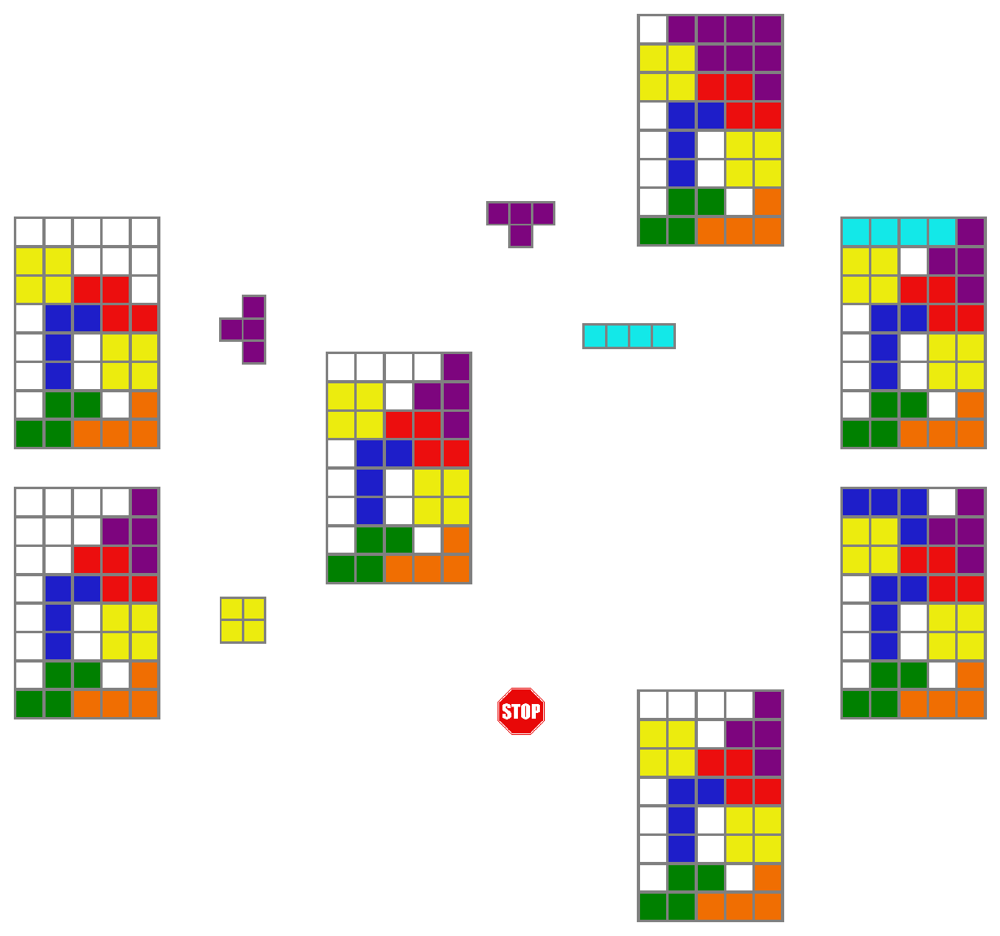

Introduction by Example
=======================

Welcome to the introduction of **gflownet**, a library designed to facilitate training and extending Generative Flow Networks (GFlowNets) for a wide range of applications, especially in scientific discovery. GFlowNets provide a framework for probabilistic and generative modeling.

What are GFlowNets?
-------------------

Generative Flow Networks, or GFlowNets, are a type of generative model that sample objects $x \in \mathcal{X}$ proportionally to a reward function $R(x)$. This framework is particularly suited for applications where the goal is to generate diverse high-reward samples, such as in scientific discovery.

.. image:: ../figures/reward_landscape.png
   :align: center
   :width: 400
   :alt: Reward landscape

The model learns to transition between states in a way that the frequency of generating any given state is proportional to its reward. For instance, a GFlowNet trained on a 2D space with four high-reward areas would learn to sample those areas more frequently.

Compositionality and Sampling
------------------------------

GFlowNets utilize compositionality by decomposing samples $x$ into sequences of intermediate states, such as:

In the example of generating Tetris-like boards, each board configuration is built by adding one piece at a time, starting from an empty board. Each intermediate state has potential "parents" and "children," forming a directed graph over states, where each edge (transition from one state to another) is modeled and learned.

Key Components
--------------

**gflownet** comprises several core components essential for its operation:

- **Environment**: Defines the state and action spaces for tasks, such as the Tetris or Scrabble environments.
- **Proxy**: Manages the reward function logic, essential for evaluating states.
- **Policy Models**: Neural networks that model the transitions between states.
- **GFlowNet Agent**: Orchestrates interactions between the environment, policies, and proxy, among other functions.